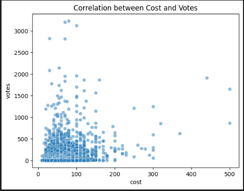

# 📊 Assignment 1 – Data Science & Statistical Analysis

## 📌 Project Overview
This project presents an exploratory data analysis and statistical modelling workflow, demonstrating core data science skills including data preprocessing, visualization, and predictive modelling.

The analysis focuses on uncovering patterns, identifying trends, and generating insights from real-world data.

---

## 🎯 Objectives
- Perform data cleaning and preprocessing  
- Conduct exploratory data analysis (EDA)  
- Identify key trends and relationships  
- Apply statistical and/or machine learning models  
- Interpret results to generate meaningful insights  

---

## 🧠 Methods & Techniques
- Data Cleaning & Transformation  
- Exploratory Data Analysis (EDA)  
- Data Visualisation (plots, charts)  
- Statistical Modelling / Machine Learning  
- Feature Engineering  

---

## 📈 Sample Output

## 📊 Correlation: Cost vs Votes

